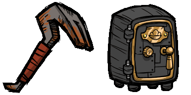

<h1> Hi, DJ4nto here ! </h1>

<h4>Any questions ?</h4>

&nbsp;
&nbsp;

 

### I am a French student interested in mathematics and computer science. I love playing CTFs.

<h4>Have a look at my web portfolio -  </h4>

<h3></h3>

 
 

<h3></h3>

 
 

 

<h3 align="left">Currently breaking encryption algorithms on <a href="https://www.root-me.org/DJ4nto">root-me</a>
 
 
Currently working on <a href="https://github.com/DJ4nto/DubMania">DubMania</a></h3>

 
 

#
<!--

-->